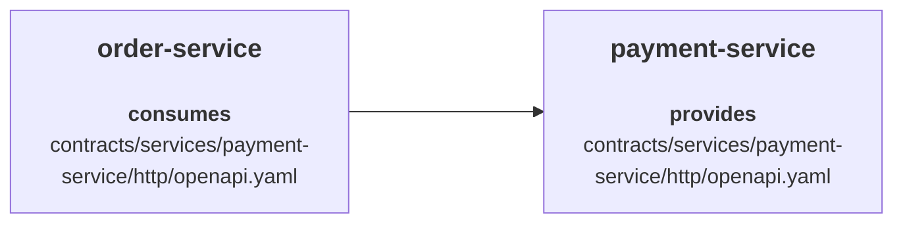

# Central Contract Repository

In a central contract repository setup, all contracts/specifications are stored in one shared repository that acts as the common source of truth for providers and consumers.

Here is a **[video](https://youtu.be/U5Agz-mvYIU?t=1827)** on this.

## File organization

**[Sample Central Contract Repository](https://github.com/specmatic/specmatic-order-contracts)**

- **Package Naming Convention**: In the [sample repo](https://github.com/specmatic/specmatic-order-contracts), the OpenAPI API specifications are organized in a manner similar to a package naming convention. This helps with easy identification of the appropriate files for organizations with large numbers of microservices and API specifications.
- **Specification file name**: It is helpful to have the version number appended to the API specification file name.
- **Extracting common schema**: We recommend extracting common schema components to avoid duplication. For example, [common.yaml](https://github.com/specmatic/specmatic-order-contracts/blob/main/io/specmatic/examples/store/openapi/common.yaml) contains only schema components which are leveraged as remote references in [api_order_v3.yaml](https://github.com/specmatic/specmatic-order-contracts/blob/main/io/specmatic/examples/store/openapi/api_order_v3.yaml).
- **Consistency and standardisation**: Commonly used parameters such as `traceIds` can be defined in one place and used across schemas.
- **Avoid duplication related issues**: It is common to miss updating or renaming some parts of a schema. By extracting common schema, we can significantly reduce this risk.

## Central Contract Repository Example

In this example, we will use:

- `central-contract-repository` stores contracts for both `payment-service` and `order-service`
- `payment-service` provides its own contract from the central contract repository
- `order-service` also provides its own contract from the central contract repository, and in this example it consumes the shared `payment-service` contract from the same repository



### central-contract-repository

The central contract repository stores the shared contracts/specifications that providers and consumers both refer to.

For this example, the relevant contracts are:

```text
contracts/services/order-service/http/openapi.yaml
contracts/services/payment-service/http/openapi.yaml
```

### payment-service

`payment-service` is the provider in this example.

Its `specmatic.yaml` points to the shared central contract repository for its own contract/specification:

```yaml title="payment-service/specmatic.yaml"
systemUnderTest:
  service:
    $ref: "#/components/services/paymentService"
components:
  sources:
    centralContractRepo:
      git:
        url: https://github.com/specmatic-demo/central-contract-repository
  services:
    paymentService:
      definitions:
        - definition:
            source:
              $ref: "#/components/sources/centralContractRepo"
            specs:
              - spec:
                  path: "contracts/services/payment-service/http/openapi.yaml"
```

### order-service

`order-service` is also a provider, but in this example we are looking at it as a consumer of the shared `payment-service` contract from the central contract repository.

It uses the following shared contract from the central contract repository:

```text
contracts/services/payment-service/http/openapi.yaml
```

Its `specmatic.yaml` points to that same contract/specification in the central contract repository:

```yaml title="order-service/specmatic.yaml"
systemUnderTest:
  service:
    $ref: "#/components/services/orderService"
dependencies:
  services:
    - service:
        $ref: "#/components/services/paymentService"
components:
  sources:
    centralContractRepo:
      git:
        url: https://github.com/specmatic-demo/central-contract-repository
  services:
    orderService:
      definitions:
        - definition:
            source:
              $ref: "#/components/sources/centralContractRepo"
            specs:
              - spec:
                  path: "contracts/services/order-service/http/openapi.yaml"
    paymentService:
      definitions:
        - definition:
            source:
              $ref: "#/components/sources/centralContractRepo"
            specs:
              - spec:
                  path: "contracts/services/payment-service/http/openapi.yaml"
```

To learn more about `specmatic.yaml`, see [Specmatic configuration](/references/configuration).

## Repository flow

In the central contract repository model, two different report types are involved:

1. a central contract repo report
2. a service build report

### Central contract repo report

#### Generate the central contract repo report

:::important
Please ensure the repository Git root is mounted into the container.
:::

Run this from the central contract repository root:

```bash
docker run --rm -it \
  -v "$(pwd):/usr/src/app" \
  -v ~/.specmatic:/root/.specmatic \
  -w /usr/src/app \
  specmatic/enterprise \
  central-contract-repo-report
```

This generates the central contract repo report at:

- `build/reports/specmatic/central_contract_repo_report.json`

### Service build report

Run these steps from the relevant service repositories.

#### Start the service

Start the service using Docker or your usual startup method:

```bash
docker compose up --build
```

#### Run the contract test suite

In another terminal:

```bash
docker run --rm -it \
  -v "$(pwd):/usr/src/app" \
  -v ~/.specmatic:/root/.specmatic \
  -w /usr/src/app \
  specmatic/enterprise \
  run-suite
```

For repositories such as `order-service` that also consume other dependencies, `run-suite` will start the dependency mocks and then run the contract tests.

Both `payment-service` and `order-service` will produce service build reports from their repository roots.

To learn more about contract testing, see [Contract Testing](/contract_driven_development/contract_testing).

## CI Workflows

### PR Process

Pull requests on the central contract repository should run the usual pre-merge checks for contracts/specifications before they are merged.

To learn more about the shared PR process for contract repositories, see [PR Process](/contract_driven_development/contract_repositories#pull-request--merge-request-process).

### Posting reports to Insights

Publish reports to Insights only from workflows that run on push or merge to `main`.

### Central contract repository workflow

For the central contract repository:

1. Generate the central contract repo report
2. Publish the central contract repo report to Insights

For example:

```yaml
name: Central Contract Repo Reports

on:
  push:
    branches:
      - main

jobs:
  publish-central-contract-repo-report:
    runs-on: ubuntu-latest
    steps:
      - uses: actions/checkout@v6

      - name: Save Specmatic license
        run: |
          mkdir -p ~/.specmatic
          echo "${{ secrets.SPECMATIC_LICENSE_KEY }}" > ~/.specmatic/specmatic-license.txt

      - name: Generate Central Contract Repo Report
        run: |
          # Ensure the repository Git root is mounted into the container.
          docker run --rm -it \
            -v "$(pwd):/usr/src/app" \
            -v ~/.specmatic:/root/.specmatic \
            -w /usr/src/app \
            specmatic/enterprise \
            central-contract-repo-report

      - name: Publish Central Contract Repo Report to Insights
        run: |
          # Ensure the repository Git root is mounted into the container.
          docker run --rm -it \
            -v "$(pwd):/usr/src/app" \
            -v ~/.specmatic:/root/.specmatic \
            -w /usr/src/app \
            specmatic/enterprise \
            send-report \
            --branch-name=main \
            --repo-name="$(gh repo view --json name -q .name)" \
            --repo-id="$(gh api 'repos/{owner}/{repo}' --jq .id)" \
            --repo-url="$(gh repo view --json url --jq .url)"
```

### Service repository workflow

For a provider or consumer repository that points to the central contract repository:

1. Start the service
2. Run the contract test suite
3. Publish the service build report to Insights

For example:

```yaml
name: Service Build Reports

on:
  push:
    branches:
      - main

jobs:
  publish-service-build-report:
    runs-on: ubuntu-latest
    steps:
      - uses: actions/checkout@v6

      - name: Save Specmatic license
        run: |
          mkdir -p ~/.specmatic
          echo "${{ secrets.SPECMATIC_LICENSE_KEY }}" > ~/.specmatic/specmatic-license.txt

      - name: Start Service
        run: docker compose up --build -d

      - name: Run Contract Test Suite
        run: |
          docker run --rm -it \
            -v "$(pwd):/usr/src/app" \
            -v ~/.specmatic:/root/.specmatic \
            -w /usr/src/app \
            specmatic/enterprise \
            run-suite

      - name: Publish Service Build Report to Insights
        run: |
          docker run --rm -it \
            -v "$(pwd):/usr/src/app" \
            -v ~/.specmatic:/root/.specmatic \
            -w /usr/src/app \
            specmatic/enterprise \
            send-report \
            --branch-name=main \
            --repo-name="$(gh repo view --json name -q .name)" \
            --repo-id="$(gh api 'repos/{owner}/{repo}' --jq .id)" \
            --repo-url="$(gh repo view --json url --jq .url)"
```

## How this will look in Insights

### How are Central Contract Repo Reports processed in Insights?

Every central contract repo report pushed to Insights results in a `Spec Repository` block being rendered on the dashboard.

Since this model uses one central contract repository, Insights will show only one `Spec Repository` block for that repository.

The `Spec Repository` block lists all the specs that were present in the central contract repo report in a directory structure.

### How are Service Build Reports processed in Insights?

For each spec, Insights will check if there exists a service build in which this specification is provided/implemented.
If found, Insights will display the service repo name as the center block.

Then Insights will check if there exists a service build in which this specification is mocked/consumed.
If found, Insights will display the service repo name on the left-hand side and link it to the provider service in the center block.

If the provider service in the center block also consumes other specifications, Insights will display those provider services on the right-hand side and link them to the center block as dependencies.

For the `central-contract-repository`, `payment-service`, and `order-service` example in this page, the following snapshot shows the complete view in Insights:


In this view:

- for `order-service`, Insights shows `order-service` in the center because it provides the `order-service` contract/specification, and `payment-service` on the right-hand side because `order-service` consumes that dependency
- for `payment-service`, Insights shows `payment-service` in the center because it provides the `payment-service` contract/specification, and `order-service` on the left-hand side because `order-service` consumes it

## Troubleshooting

### The provider service is missing in Insights

Check that:

1. the central contract repo report was generated from the central contract repository and posted to Insights
2. the provider contract test suite was run and the service build report was posted to Insights
3. the provider repository points to the correct spec path in the central contract repository

### The consumer service is missing in Insights

Check that:

1. the consumer points to the central contract repository and the correct spec path
2. the central contract repo report was generated and posted to Insights
3. the consumer contract test suite was run and the consumer service build report was posted to Insights
4. the consumer repository points to the same shared contract/specification in the central contract repository
