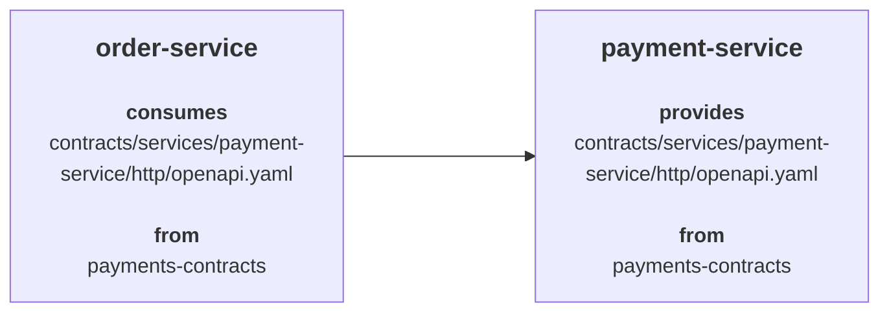

# Federated Repositories

In a federated setup, contracts/specifications are distributed across multiple contract-only repositories instead of one central contract repository.

These repositories still contain contracts/specifications only. The difference is that they are split across multiple repositories, for example by domain, department, or business unit.

## Federated Repositories Example

In this example, we will use:

### Contract Repositories

- `payments-contracts` stores payment-domain contracts/specifications
- `orders-contracts` stores order-domain contracts/specifications

### Service Repositories

- `payment-service` provides its contract from `payments-contracts`
- `order-service` provides its own contract from `orders-contracts`, and in this example it consumes the shared `payment-service` contract from `payments-contracts`



### payments-contracts

The `payments-contracts` repository stores the shared contracts/specifications for the payments domain.

For this example, the relevant contract/specification is:

```text
contracts/services/payment-service/http/openapi.yaml
```

### orders-contracts

The `orders-contracts` repository stores the shared contracts/specifications for the orders domain.

For this example, the relevant contract/specification is:

```text
contracts/services/order-service/http/openapi.yaml
```

### payment-service

`payment-service` is the provider in this example.

Its `specmatic.yaml` points to the `payments-contracts` repository for its own contract/specification:

```yaml title="payment-service/specmatic.yaml"
systemUnderTest:
  service:
    $ref: "#/components/services/paymentService"
components:
  sources:
    paymentsContracts:
      git:
        url: https://github.com/example/payments-contracts
  services:
    paymentService:
      definitions:
        - definition:
            source:
              $ref: "#/components/sources/paymentsContracts"
            specs:
              - spec:
                  path: "contracts/services/payment-service/http/openapi.yaml"
```

### order-service

`order-service` is also a provider, but in this example we are looking at it as a consumer of the shared `payment-service` contract from `payments-contracts`.

Its `specmatic.yaml` points to:

- `orders-contracts` for its own `order-service` contract/specification
- `payments-contracts` for the shared `payment-service` contract/specification

```yaml title="order-service/specmatic.yaml"
systemUnderTest:
  service:
    $ref: "#/components/services/orderService"
dependencies:
  services:
    - service:
        $ref: "#/components/services/paymentService"
components:
  sources:
    ordersContracts:
      git:
        url: https://github.com/example/orders-contracts
    paymentsContracts:
      git:
        url: https://github.com/example/payments-contracts
  services:
    orderService:
      definitions:
        - definition:
            source:
              $ref: "#/components/sources/ordersContracts"
            specs:
              - spec:
                  path: "contracts/services/order-service/http/openapi.yaml"
    paymentService:
      definitions:
        - definition:
            source:
              $ref: "#/components/sources/paymentsContracts"
            specs:
              - spec:
                  path: "contracts/services/payment-service/http/openapi.yaml"
```

To learn more about `specmatic.yaml`, see [Specmatic configuration](/references/configuration).

## Repository flow

The repository flow in the federated model is similar to [Central Contract Repository](/contract_driven_development/contract_repositories/central_contract_repository#repository-flow).

The main differences are:

- run the central contract repo report flow separately for each federated contract repository
- service repositories may point to one or more federated contract repositories, depending on how contracts/specifications are split

## CI Workflows

### PR Process

Pull requests on each federated contract repository should run the usual pre-merge checks for contracts/specifications before they are merged.

To learn more about the shared PR process for contract repositories, see [PR Process](/contract_driven_development/contract_repositories#pull-request--merge-request-process).

### Posting reports to Insights

Publish reports to Insights only from workflows that run on push or merge to `main`.

### Federated contract repository workflow

The federated contract repository workflow is the same as in [Central Contract Repository](/contract_driven_development/contract_repositories/central_contract_repository#central-contract-repository-workflow).

In the federated model, run that workflow for each federated contract repository.

### Service repository workflow

The service repository workflow in the federated model is the same as in [Central Contract Repository](/contract_driven_development/contract_repositories/central_contract_repository#service-repository-workflow).

## How this will look in Insights

Insights processes federated contract repositories in the same way as a [Central Contract Repository](/contract_driven_development/contract_repositories/central_contract_repository), but instead of one shared central contract repository, it will show one `Spec Repository` block per federated contract repository.

In this example, you will see two `Spec Repository` blocks:

- `order-contracts`
- `payment-contracts`

### order-contracts Spec Repository block

The following snapshot shows the `order-contracts` repository in Insights:


In this view:

- the `Spec Repository` block comes from the `order-contracts` central contract repo report
- the block lists the contracts/specifications stored in `order-contracts`, such as `contracts/services/order-service/http/openapi.yaml`
- `order-service` appears in the center because it provides the `order-service` contract/specification from `order-contracts`
- there are no consumers shown on the left-hand side for this contract/specification
- `payment-service` appears on the right-hand side because `order-service` consumes that dependency

### payment-contracts Spec Repository block

The following snapshot shows the `payment-contracts` repository in Insights:


In this view:

- the `Spec Repository` block comes from the `payment-contracts` central contract repo report
- the block lists the contracts/specifications stored in `payment-contracts`, such as `contracts/services/payment-service/http/openapi.yaml`
- `payment-service` appears in the center because it provides the `payment-service` contract/specification from `payment-contracts`
- `order-service` appears on the left-hand side because it consumes the shared `payment-service` contract/specification from `payment-contracts`
- there are no dependencies shown on the right-hand side for this contract/specification

## Troubleshooting

Troubleshooting in the federated model is similar to [Central Contract Repository](/contract_driven_development/contract_repositories/central_contract_repository#troubleshooting).

The main differences are:

- make sure the relevant central contract repo report was generated from the correct federated contract repository and posted to Insights
- make sure the provider or consumer repository points to the correct spec path in the correct federated contract repository
