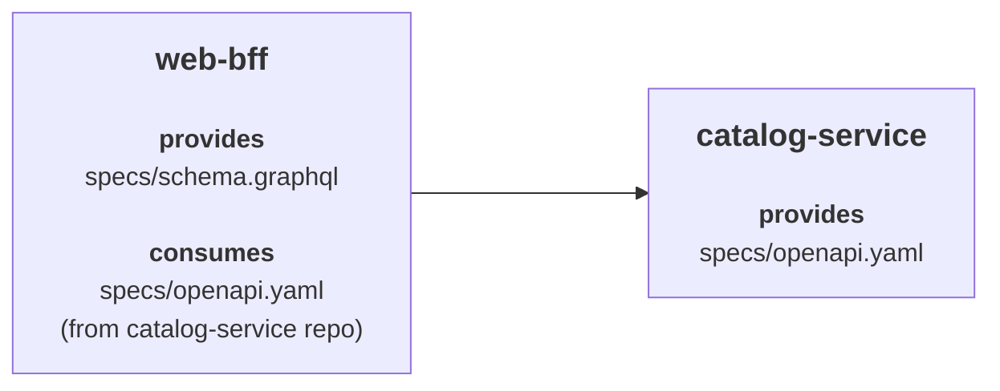

# Provider Repositories

In a provider repository setup, each provider stores the contracts/specifications that it provides in its own repository. Consumers then point directly to that provider repository.

## Provider Repository Example

- `catalog-service` provides the contract at `specs/openapi.yaml`
- `web-bff` provides `specs/schema.graphql` and consumes the `catalog-service` contract from the `catalog-service` repository



### catalog-service

`catalog-service` is the provider.

It owns the contract locally in its own repository, and its `specmatic.yaml` uses a filesystem source that points to the `specs/` directory.

This is how the `specmatic.yaml` looks:

```yaml title="catalog-service/specmatic.yaml"
systemUnderTest:
  service:
    $ref: "#/components/services/catalogService"
components:
  sources:
    localSpecs:
      filesystem:
        directory: specs
  services:
    catalogService:
      definitions:
        - definition:
            source:
              $ref: "#/components/sources/localSpecs"
            specs:
              - spec:
                  path: "openapi.yaml"
```

To learn more about `specmatic.yaml`, see [Specmatic configuration](/references/configuration).

### web-bff

`web-bff` is also a provider repository, but in this example we are looking at it as a consumer of `catalog-service`.

In its `specmatic.yaml`, it:

- uses a local filesystem source for its own GraphQL contract
- points to the `catalog-service` Git repository for the provider-owned OpenAPI contract

```yaml title="web-bff/specmatic.yaml"
systemUnderTest:
  service:
    $ref: "#/components/services/webBff"
dependencies:
  services:
    - service:
        $ref: "#/components/services/catalogService"
components:
  sources:
    localSpecs:
      filesystem:
        directory: specs
    catalogServiceRepo:
      git:
        url: https://github.com/specmatic-demo/catalog-service
  services:
    webBff:
      definitions:
        - definition:
            source:
              $ref: "#/components/sources/localSpecs"
            specs:
              - spec:
                  path: "schema.graphql"
    catalogService:
      definitions:
        - definition:
            source:
              $ref: "#/components/sources/catalogServiceRepo"
            specs:
              - spec:
                  path: "specs/openapi.yaml"
```

## Repository flow

Both repositories in this example produce two different report types:

1. a central contract repo report
2. a service build report

### Central contract repo report

#### Generate the central contract repo report

:::important
Please ensure the repository Git root is mounted into the container.
:::

Run this from the provider repository root, while setting the container working directory to the `specs/` folder:

```bash
docker run --rm -it \
  -v "$(pwd):/usr/src/app" \
  -v ~/.specmatic:/root/.specmatic \
  -w /usr/src/app/specs \
  specmatic/enterprise \
  central-contract-repo-report
```

This generates the central contract repo report at:

- `build/reports/specmatic/central_contract_repo_report.json`

### Service build report

#### Start the service

Start the service using Docker or your usual startup method:

```bash
docker compose up --build
```

#### Run the contract test suite

:::important
Please ensure the repository Git root is mounted into the container.
:::

In another terminal:

```bash
docker run --rm -it \
  -v "$(pwd):/usr/src/app" \
  -v ~/.specmatic:/root/.specmatic \
  -w /usr/src/app \
  specmatic/enterprise \
  run-suite
```

For repositories such as `web-bff` that both own a local contract and consume provider-owned contracts, `run-suite` will start the dependency mocks and then run the contract tests.

In this example:

- `catalog-service` produces:
  - `build/reports/specmatic/test/html/index.html`
  - `build/reports/specmatic/test/ctrf/ctrf-report.json`

- `web-bff` produces:
  - `build/reports/specmatic/graphql/test/html/index.html`
  - `build/reports/specmatic/graphql/test/ctrf/ctrf-report.json`
  - `build/reports/specmatic/stub/html/index.html`
  - `build/reports/specmatic/stub/ctrf/ctrf-report.json`

To learn more about contract testing, see [Contract Testing](/contract_driven_development/contract_testing).

## CI Workflows

### PR Process

Pull requests should run the usual pre-merge checks for contracts/specifications before they are merged.

To learn more about the shared PR process for contract repositories, see [PR Process](/contract_driven_development/contract_repositories#pull-request--merge-request-process).

### Posting reports to Insights

Publish reports to Insights only from workflows that run on push or merge to `main`.

### Repository workflow

For a repository that owns a contract/specification:

1. Generate the central contract repo report
2. Publish the central contract repo report to Insights
3. Start the service
4. Run the contract test suite
5. Publish the service build report to Insights

For example:

```yaml
name: Repository Reports

on:
  push:
    branches:
      - main

jobs:
  publish-reports:
    runs-on: ubuntu-latest
    steps:
      - uses: actions/checkout@v6

      - name: Save Specmatic license
        run: |
          mkdir -p ~/.specmatic
          echo "${{ secrets.SPECMATIC_LICENSE_KEY }}" > ~/.specmatic/specmatic-license.txt

      - name: Generate Central Contract Report
        run: |
          # Ensure the repository Git root is mounted into the container.
          docker run --rm -it \
            -v "$(pwd):/usr/src/app" \
            -v ~/.specmatic:/root/.specmatic \
            -w /usr/src/app/specs \
            specmatic/enterprise \
            central-contract-repo-report

      - name: Publish Central Contract Report to Insights
        run: |
          # Ensure the repository Git root is mounted into the container.
          docker run --rm -it \
            -v "$(pwd):/usr/src/app" \
            -v ~/.specmatic:/root/.specmatic \
            -w /usr/src/app/specs \
            specmatic/enterprise \
            send-report \
            --branch-name=main \
            --repo-name="$(gh repo view --json name -q .name)" \
            --repo-id="$(gh api 'repos/{owner}/{repo}' --jq .id)" \
            --repo-url="$(gh repo view --json url --jq .url)"

      - name: Start Service
        run: docker compose up --build -d

      - name: Run Contract Test Suite
        run: |
          # Ensure the repository Git root is mounted into the container.
          docker run --rm -it \
            -v "$(pwd):/usr/src/app" \
            -v ~/.specmatic:/root/.specmatic \
            -w /usr/src/app \
            specmatic/enterprise \
            run-suite

      - name: Publish Service Build Report to Insights
        run: |
          # Ensure the repository Git root is mounted into the container.
          docker run --rm -it \
            -v "$(pwd):/usr/src/app" \
            -v ~/.specmatic:/root/.specmatic \
            -w /usr/src/app \
            specmatic/enterprise \
            send-report \
            --branch-name=main \
            --repo-name="$(gh repo view --json name -q .name)" \
            --repo-id="$(gh api 'repos/{owner}/{repo}' --jq .id)" \
            --repo-url="$(gh repo view --json url --jq .url)"
```

## How this will look in Insights

### How are Central Contract Repo Reports processed in Insights?

Every central contract repo report pushed to Insights results in a `Spec Repository` block being rendered on the dashboard.

The `Spec Repository` block lists all the specs that were present in the central contract repo report in a directory structure.

### How are Service Build Reports processed in Insights?

For each spec, Insights will check if there exists a service build in which this specification is provided/implemented.
If found, Insights will display the service repo name as the center block.

Then Insights will check if there exists a service build in which this specification is mocked/consumed.
If found, Insights will display the service repo name on the left-hand side and link it to the provider service in the center block.

If the provider service in the center block also consumes other specifications, Insights will display those provider services on the right-hand side and link them to the center block as dependencies.

### Catalog Service Spec Repository Block

Since `catalog-service` has the `openapi.yaml` spec in its `specs/` folder, Insights shows one row for that spec inside the `Spec Repository` block.

Once the `catalog-service` service build report is processed, Insights identifies `catalog-service` as the provider for that spec and displays it as the center block.

Once a consumer build such as `web-bff` is processed, Insights links that consumer to the same spec and displays it on the left-hand side.


### Web Bff Spec Repository Block

Since `web-bff` has the `schema.graphql` spec in its own `specs/` folder, its central contract repo report creates a separate `Spec Repository` block for that GraphQL spec.

When the `web-bff` service build report is processed, Insights identifies `web-bff` as the provider for `schema.graphql` and displays it as the center block.

When a consumer build such as `web-frontend` is processed, Insights links that consumer to the `web-bff` contract and shows it on the left-hand side.

At the same time, because `web-bff` also consumes the `catalog-service` contract, the view shows `catalog-service` on the right-hand side as a dependency that `web-bff` is using.


To learn more about Insights stats, see [Insights Stats Overview](/enterprise_onboarding/insights_stats_overview).

## Troubleshooting

### The provider service is missing in Insights

Check that:

1. the `central-contract-repo-report` was generated from the provider repository and posted to Insights
2. the provider contract test suite was run and the service build report was posted to Insights
3. when running the provider contract test suite, the repository Git root was mounted into the container

### The consumer service is missing in Insights

Check that:

1. the consumer points to the provider repository and the correct spec path
2. the provider's `central-contract-repo-report` was generated and posted to Insights
3. the consumer contract test suite was run and the consumer service build report was posted to Insights
4. when running the consumer contract test suite, the repository Git root was mounted into the container
