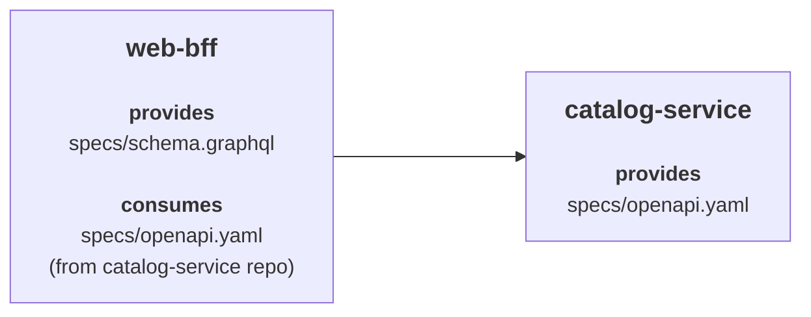

# Federated Repositories

In a federated setup, each provider stores the contracts/specifications that it provides or implements in its own repository. Consumers then point directly to the provider repository.

So, instead of one [central contract repository](/contract_driven_development/central_contract_repository) containing all the contracts, the contracts are distributed across multiple provider repositories. Hence, this model is called **federated**.

This page focuses on the federated model.

To learn more about the central repo model, see [Central Contract Repository](/contract_driven_development/central_contract_repository).

## Federated Repository Example

- `catalog-service` provides the contract at `specs/openapi.yaml`
- `web-bff` provides `specs/schema.graphql` and consumes the `catalog-service` contract from the `catalog-service` repository



### catalog-service

`catalog-service` is the provider.

It owns the contract locally in its own repository, and its `specmatic.yaml` uses a filesystem source that points to the `specs/` directory.

This is how the `specmatic.yaml` looks:

```yaml title="catalog-service/specmatic.yaml"
systemUnderTest:
  service:
    $ref: "#/components/services/catalogService"
components:
  sources:
    localSpecs:
      filesystem:
        directory: specs
  services:
    catalogService:
      definitions:
        - definition:
            source:
              $ref: "#/components/sources/localSpecs"
            specs:
              - spec:
                  path: "openapi.yaml"
```

To learn more about `specmatic.yaml`, see [Specmatic configuration](/references/configuration).

### web-bff

`web-bff` is the consumer for this example. It implements its own GraphQL contract at `specs/schema.graphql`.

In its `specmatic.yaml`, it:

- uses a local filesystem source for its own GraphQL contract
- points to the `catalog-service` Git repository for the provider-owned OpenAPI contract

```yaml title="web-bff/specmatic.yaml"
systemUnderTest:
  service:
    $ref: "#/components/services/webBff"
dependencies:
  services:
    - service:
        $ref: "#/components/services/catalogService"
components:
  sources:
    localSpecs:
      filesystem:
        directory: specs
    catalogServiceRepo:
      git:
        url: https://github.com/specmatic-demo/catalog-service
  services:
    webBff:
      definitions:
        - definition:
            source:
              $ref: "#/components/sources/localSpecs"
            specs:
              - spec:
                  path: "schema.graphql"
    catalogService:
      definitions:
        - definition:
            source:
              $ref: "#/components/sources/catalogServiceRepo"
            specs:
              - spec:
                  path: "specs/openapi.yaml"
```

## Provider flow

The provider repository produces two different report types:

1. a central contract report
2. a service build report

### Central repo report

#### Generate the federated central contract report

:::important
Please ensure the repository Git root is mounted into the container.
:::

Run this from the provider repository root, while setting the container working directory to the `specs/` folder:

```bash
docker run --rm -it \
  -v "$(pwd):/usr/src/app" \
  -v ~/.specmatic:/root/.specmatic \
  -w /usr/src/app/specs \
  specmatic/enterprise \
  central-contract-repo-report
```

This generates the central contract repo report at:

- `build/reports/specmatic/central_contract_repo_report.json`

### Provider service tests

#### Start the provider service

Start the provider service using Docker or your usual startup method:

```bash
docker compose up --build
```

#### Run provider contract tests

:::important
Please ensure the repository Git root is mounted into the container.
:::

In another terminal:

```bash
docker run --rm -it \
  -v "$(pwd):/usr/src/app" \
  -v ~/.specmatic:/root/.specmatic \
  -w /usr/src/app \
  specmatic/enterprise \
  test
```

As our example provider service (`catalog-service`) provides an OpenAPI spec, you should see the build reports in:

- `build/reports/specmatic/test/html/index.html`
- `build/reports/specmatic/test/ctrf/ctrf-report.json`

To learn more about contract testing, see [Contract Testing](/contract_driven_development/contract_testing).

## Consumer flow

For this consumer example:

- `web-bff` uses the federated `catalog-service` contract
- `web-bff` itself implements a GraphQL spec at `specs/schema.graphql`

### Dependency mocks

#### Start dependency mocks

For this example, this will include the `catalog-service` dependency mock.

:::important
Please ensure the repository Git root is mounted into the container.
:::

```bash
docker run --rm -it \
  -v "$(pwd):/usr/src/app" \
  -v ~/.specmatic:/root/.specmatic \
  -w /usr/src/app \
  specmatic/enterprise \
  mock
```

### Consumer service tests

#### Start the consumer service

Start the consumer service using Docker or your usual startup method:

```bash
docker compose up --build
```

#### Run consumer tests

:::important
Please ensure the repository Git root is mounted into the container.
:::

```bash
docker run --rm -it \
  -v "$(pwd):/usr/src/app" \
  -v ~/.specmatic:/root/.specmatic \
  -w /usr/src/app \
  specmatic/enterprise \
  test
```

As our example consumer service (`web-bff`) implements a GraphQL spec and consumes the federated `catalog-service` contract, you should now see build reports in:

- `build/reports/specmatic/graphql/test/html/index.html`
- `build/reports/specmatic/graphql/test/ctrf/ctrf-report.json`
- `build/reports/specmatic/stub/html/index.html`
- `build/reports/specmatic/stub/ctrf/ctrf-report.json`

To learn more about dependency mocks and stubs, see [Service Virtualization](/contract_driven_development/service_virtualization).

## Posting to Insights in CI

In your CI workflow, after the relevant reports have been generated, run `send-report`.

### Provider CI steps

For a provider repository:

1. generate the federated central contract repo report
2. send the central contract repo report to Insights
3. run the provider contract tests
4. send the provider service build report to Insights

#### Send the central contract repo report to Insights

:::important
Please ensure the repository Git root is mounted into the container.
:::

After the central contract repo report has been generated, run:

```bash
docker run --rm -it \
  -v "$(pwd):/usr/src/app" \
  -v ~/.specmatic:/root/.specmatic \
  -w /usr/src/app/specs \
  specmatic/enterprise \
  send-report \
  --branch-name=main \
  --repo-name="$(gh repo view --json name -q .name)" \
  --repo-id="$(gh api 'repos/{owner}/{repo}' --jq .id)" \
  --repo-url="$(gh repo view --json url --jq .url)"
```

#### Send the provider service build report to Insights

:::important
Please ensure the repository Git root is mounted into the container.
:::

After the provider contract tests have completed, run:

```bash
docker run --rm -it \
  -v "$(pwd):/usr/src/app" \
  -v ~/.specmatic:/root/.specmatic \
  -w /usr/src/app \
  specmatic/enterprise \
  send-report \
  --branch-name=main \
  --repo-name="$(gh repo view --json name -q .name)" \
  --repo-id="$(gh api 'repos/{owner}/{repo}' --jq .id)" \
  --repo-url="$(gh repo view --json url --jq .url)"
```

### Consumer CI steps

For a consumer repository:

1. run the consumer tests
2. send the consumer service build report to Insights

#### Send the consumer service build report to Insights

:::important
Please ensure the repository Git root is mounted into the container.
:::

After the consumer tests have completed, run:

```bash
docker run --rm -it \
  -v "$(pwd):/usr/src/app" \
  -v ~/.specmatic:/root/.specmatic \
  -w /usr/src/app \
  specmatic/enterprise \
  send-report \
  --branch-name=main \
  --repo-name="$(gh repo view --json name -q .name)" \
  --repo-id="$(gh api 'repos/{owner}/{repo}' --jq .id)" \
  --repo-url="$(gh repo view --json url --jq .url)"
```

## How this will look in Insights

For the `catalog-service` and `web-bff` example in this page, this is how the federated provider contract shows up in Insights:


To learn more about Insights stats, see [Insights Stats Overview](/enterprise_onboarding/insights_stats_overview).

## Troubleshooting

### The provider service is missing in Insights

Check that:

1. the `central-contract-repo-report` was generated from the provider repository and posted to Insights
2. the provider contract tests were run and the service test report was posted to Insights
3. when running provider contract tests, the repository Git root was mounted into the container

### The consumer service is missing in Insights

Check that:

1. the consumer points to the provider repository and the correct spec path
2. the provider's `central-contract-repo-report` was generated and posted to Insights
3. the consumer tests were run and the consumer service build report was posted to Insights
4. when running consumer tests, the repository Git root was mounted into the container
