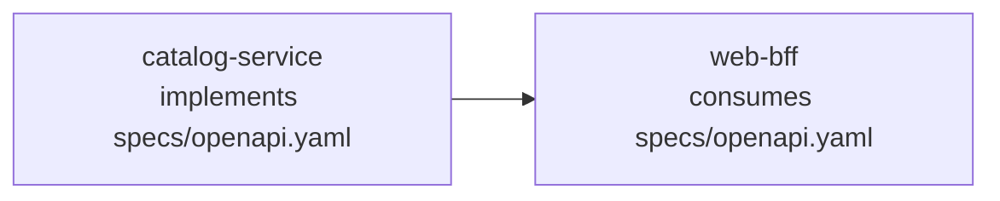

# Federated Repositories

This page explains how to work with provider-owned contract repositories in Specmatic, and how to publish both central contract reports and service build reports to Specmatic Insights.

There are two common ways to organize contracts in Specmatic.

### 1. Central contract repository

This is the recommended starting point for most teams.

In this model:

- all contracts/specifications are stored in one central contract repository
- provider repositories refer to the specs they implement from that central repo
- consumer repositories refer to the same specs from that central repo

So both providers and consumers use the same shared source of truth in their `specmatic.yaml`.

### 2. Federated repositories

In a federated setup, a provider stores its contracts/specifications in its own repository instead of using central contract repository.

This changes two things:

1. The provider contract now lives with the provider service.
2. Consumer repositories point to the provider repository and the spec path inside it.

So instead of one central repository containing every provider contract, the contracts are distributed across multiple provider repositories.

That is why this model is called **federated**.

The central contract repository can still be used as the baseline for Insights, but the central-style report for a federated provider is generated from the provider repository itself.

## Example setup

In the demo organization, we will use:

- provider repo: `catalog-service`
- consumer repo: `web-bff`

In this example:

- `catalog-service` implements the contract at `specs/openapi.yaml`
- `web-bff` consumes that contract from the `catalog-service` repository



### catalog-service

`catalog-service` is the provider. It owns the contract locally in its own repository, and its `specmatic.yaml` uses a filesystem source that points to the `specs/` directory.

That is why the service definition refers to `openapi.yaml` directly.

```yaml title="catalog-service/specmatic.yaml"
components:
  sources:
    localSpecs:
      filesystem:
        directory: specs
  services:
    catalogService:
      definitions:
        - definition:
            source:
              $ref: "#/components/sources/localSpecs"
            specs:
              - spec:
                  path: "openapi.yaml"
```

### web-bff

`web-bff` is the consumer for this example. It implements its own GraphQL contract at `specs/schema.graphql`.

In its `specmatic.yaml`, it points to the `catalog-service` Git repository and refers to the provider-owned spec using the path `specs/openapi.yaml`.

This is the key difference in a federated setup: the consumer points directly to the provider repository that owns the contract.

```yaml title="web-bff/specmatic.yaml"
components:
  sources:
    catalogServiceRepo:
      git:
        url: https://github.com/specmatic-demo/catalog-service
  services:
    catalogService:
      definitions:
        - definition:
            source:
              $ref: "#/components/sources/catalogServiceRepo"
            specs:
              - spec:
                  path: "specs/openapi.yaml"
```

## Provider flow

The provider repository produces two different report types:

1. a central contract report
2. a service build report

These serve different purposes in Insights, so they should be generated and sent separately.

## Central repo report

### Generate the federated central contract report

:::important
Mount the repository Git root into the container.
:::

Run this from the provider repository root, while setting the container working directory to the `specs/` folder:

```bash
docker run --rm -it \
  -v "$(pwd):/usr/src/app" \
  -v ~/.specmatic:/root/.specmatic \
  -w /usr/src/app/specs \
  specmatic/enterprise \
  central-contract-repo-report
```

This generates the central contract repo report at:

- `build/reports/specmatic/central_contract_repo_report.json`

### Post the central contract repo report to Insights

:::important
Mount the repository Git root into the container.
:::

Run this from the provider repository root:

```bash
docker run --rm -it \
  -v "$(pwd):/usr/src/app" \
  -v ~/.specmatic:/root/.specmatic \
  -w /usr/src/app/specs \
  specmatic/enterprise \
  send-report \
  --branch-name=main \
  --repo-name="$(gh repo view --json name -q .name)" \
  --repo-id="$(gh api 'repos/{owner}/{repo}' --jq .id)" \
  --repo-url="$(gh repo view --json url --jq .url)"
```

## Provider service tests

### Run provider contract tests

:::important
Mount the repository Git root into the container.
:::

In another terminal:

```bash
docker run --rm -it \
  -v "$(pwd):/usr/src/app" \
  -v ~/.specmatic:/root/.specmatic \
  -w /usr/src/app \
  specmatic/enterprise \
  test
```

As our example provider service (`catalog-service`) provides an OpenAPI spec, you should see the build reports in:

- `build/reports/specmatic/test/html/index.html`
- `build/reports/specmatic/test/ctrf/ctrf-report.json`

### Post the provider service build report to Insights

:::important
Mount the repository Git root into the container.
:::

After the provider test run completes, send the service build report from the repository root:

```bash
docker run --rm -it \
  -v "$(pwd):/usr/src/app" \
  -v ~/.specmatic:/root/.specmatic \
  -w /usr/src/app \
  specmatic/enterprise \
  send-report \
  --branch-name=main \
  --repo-name="$(gh repo view --json name -q .name)" \
  --repo-id="$(gh api 'repos/{owner}/{repo}' --jq .id)" \
  --repo-url="$(gh repo view --json url --jq .url)"
```

## Consumer flow

For the demo consumer:

- `web-bff` uses the federated `catalog-service` contract
- `web-bff` itself implements a GraphQL spec at `specs/schema.graphql`

### Start dependency mocks

For this example, this will include the `catalog-service` dependency mock.

:::important
Mount the repository Git root into the container.
:::

```bash
docker run --rm -it \
  -v "$(pwd):/usr/src/app" \
  -v ~/.specmatic:/root/.specmatic \
  -w /usr/src/app \
  specmatic/enterprise \
  mock
```

### Start the consumer service

Ideally, start the consumer service using Docker Compose:

```bash
docker compose up --build
```

### Run consumer tests

:::important
Mount the repository Git root into the container.
:::

```bash
docker run --rm -it \
  -v "$(pwd):/usr/src/app" \
  -v ~/.specmatic:/root/.specmatic \
  -w /usr/src/app \
  specmatic/enterprise \
  test
```

As our example consumer service (`web-bff`) implements a GraphQL spec and consumes the federated `catalog-service` contract, you should now see build reports in:

- `build/reports/specmatic/graphql/test/html/index.html`
- `build/reports/specmatic/graphql/test/ctrf/ctrf-report.json`
- `build/reports/specmatic/stub/html/index.html`
- `build/reports/specmatic/stub/ctrf/ctrf-report.json`

### Post the consumer service build report to Insights

:::important
Mount the repository Git root into the container.
:::

After the consumer test run completes, send the service build report from the consumer repository root:

```bash
docker run --rm -it \
  -v "$(pwd):/usr/src/app" \
  -v ~/.specmatic:/root/.specmatic \
  -w /usr/src/app \
  specmatic/enterprise \
  send-report \
  --branch-name=main \
  --repo-name="$(gh repo view --json name -q .name)" \
  --repo-id="$(gh api 'repos/{owner}/{repo}' --jq .id)" \
  --repo-url="$(gh repo view --json url --jq .url)"
```

## Recommended CI/CD sequence

For a federated provider:

1. generate the federated central contract report from `specs/`
2. send the federated central contract report
3. wait before sending service reports so Insights can process the contract baseline
4. run provider tests
5. send the provider service report

For a consumer:

1. run mocks and tests as usual
2. send the consumer service report from the repository root

This ordering avoids a race where service builds arrive before the federated central contract baseline is processed.

## How this will look in Insights

For the `catalog-service` and `web-bff` example in this page, this is how the federated provider contract shows up in Insights:


For more on how Insights interprets these builds, see:

- [Insights Set Up Guide](/enterprise_onboarding/insights)
- [Insights Stats Overview](/enterprise_onboarding/insights_stats_overview)

## Troubleshooting

### The provider service is missing in Insights

Check that:

1. the `central-contract-repo-report` was generated from the provider repository and posted to Insights
2. the provider contract tests were run and the service test report was posted to Insights
3. when running provider contract tests, the repository Git root was mounted into the container

### The consumer build is visible but the provider contract is not

Check that:

1. the consumer points to the provider repository and the correct spec path
2. the provider's `central-contract-repo-report` was generated and posted to Insights
3. the consumer tests were run and the consumer service build report was posted to Insights
4. when running consumer tests, the repository Git root was mounted into the container

### `send-report` does not find any reports

Check that:

- the repository root is mounted into `/usr/src/app`
- the working directory matches the report location
- reports were generated under:
  - `build/reports/specmatic`, or
  - `specs/build/reports/specmatic`
