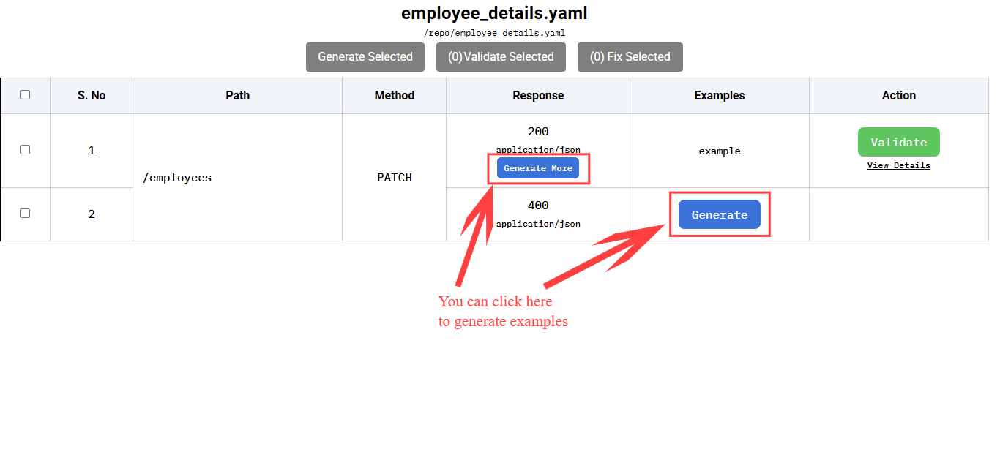
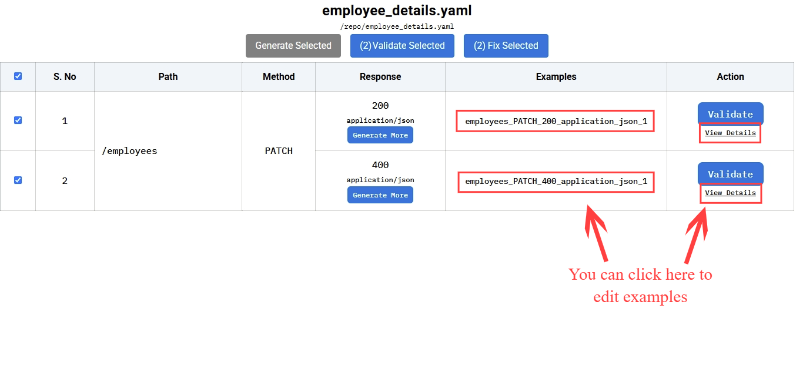
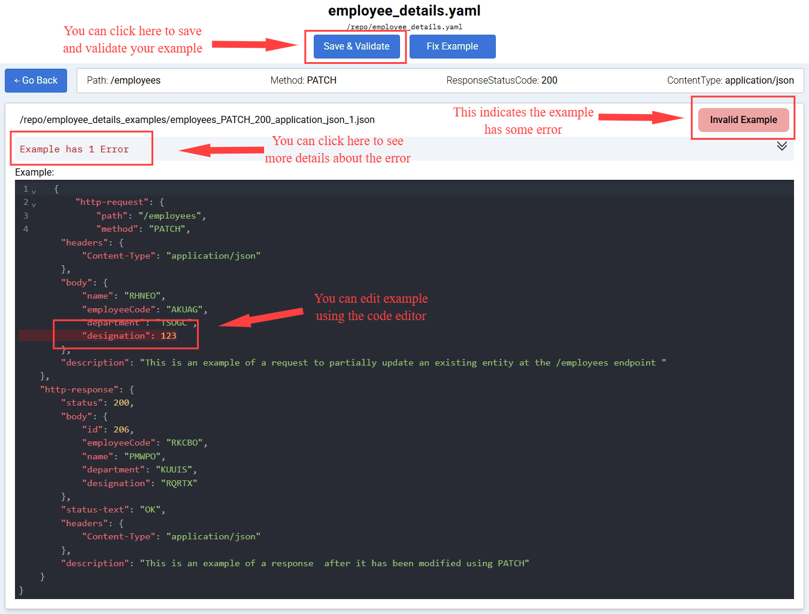
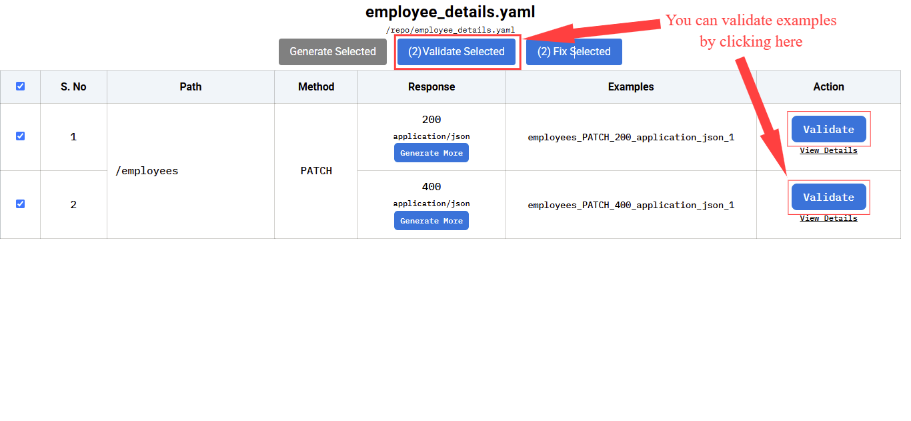
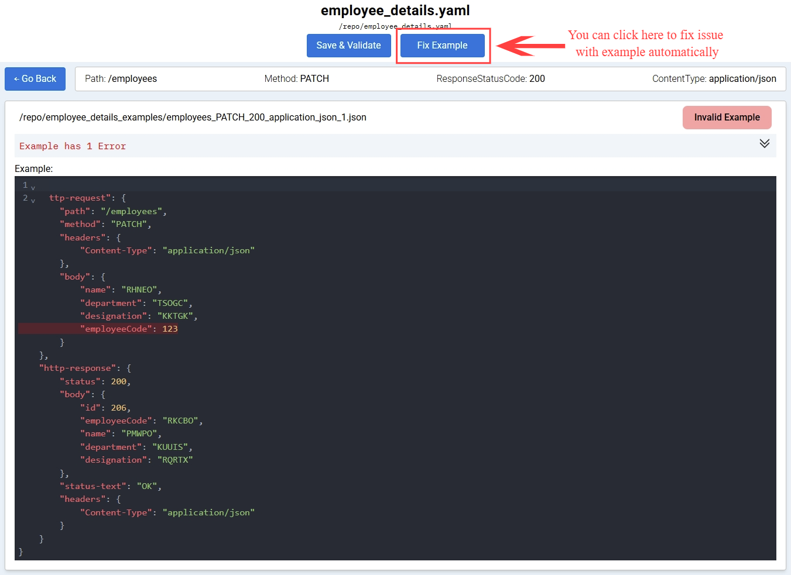
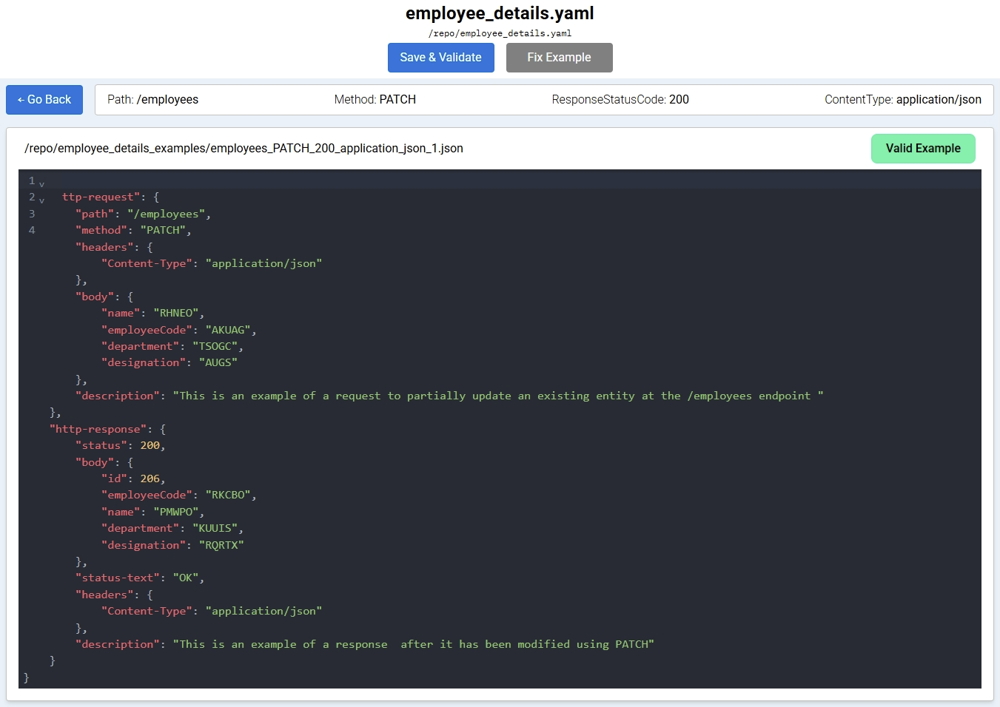

# External Examples
<!-- TOC -->
- [External Examples](#external-examples)
  - [Introduction](#introduction)
  - [Creating, Validating and Fixing Examples](#creating-validating-and-fixing-examples)
  - [Interactive Examples GUI](#interactive-examples-gui)
    - [Generating and Updating Examples](#generating-and-updating-examples)
    - [Validating Examples](#validating-examples)
    - [Fixing Examples](#fixing-examples)
  - [Creating Examples Manually](#creating-examples-manually)
  - [Using CLI to Validate Examples](#using-cli-to-validate-examples)
  - [Example Format](#example-format)
  - [Using Dictionary Values In Examples](#using-dictionary-values-in-examples)
      - [Example](#example)
      - [Dictionary](#dictionary)
      - [Starting the Stub Server](#starting-the-stub-server)
      - [Making a PATCH Request](#making-a-patch-request)
  - [Working with Multiple Specifications](#working-with-multiple-specifications)
  - [Custom Example Directory](#custom-example-directory)
  - [Identifying Examples with Competing Requests](#identifying-examples-with-competing-requests)
    - [Competing Requests by Identical Values](#competing-requests-by-identical-values)
    - [Competing Requests by Identical Data Type Values](#competing-requests-by-identical-data-type-values)
    - [Competing Requests by Overlapping Data Type Values](#competing-requests-by-overlapping-data-type-values)
    - [Lenient mode](#lenient-mode)
  - [Pro Tips](#pro-tips)
<!-- /TOC -->

## Introduction

It may not always be possible to add examples inline in the OpenAPI specifications. And sometimes certain examples may not belong in the API specification. In such cases, we add examples outside the spec in the form of JSON files.

## Creating, Validating and Fixing Examples

Create an API specification file named `employee_details.yaml` using the content below. We will use this file as a reference for creating, validating and fixing examples.

```yaml
openapi: 3.0.0
info:
  title: Employees
  version: '1.0'
servers: []
paths:
  '/employees':
    patch:
      summary: ''
      requestBody:
        content:
          application/json:
            schema:
              $ref: '#/components/schemas/EmployeeDetails'
      responses:
        '200':
          description: Employee Created Response
          content:
            application/json:
              schema:
                $ref: '#/components/schemas/Employee'
        '400':
          description: Error response
          content:
            application/json:
              schema:
                $ref: '#/components/schemas/Error'
components:
  schemas:
    Error:
      type: object
      required:
        - message
      properties:
        message:
          type: string
    Employee:
      type: object
      required:
        - id
        - name
        - department
        - designation
      properties:
        id:
          type: integer
        employeeCode:
          type: string
        name:
          type: string
        department:
          type: string
        designation:
          type: string

    EmployeeDetails:
      type: object
      required:
        - name
        - department
        - designation
      properties:
        name:
          type: string
        employeeCode:
          type: string
        department:
          type: string
        designation:
          type: string
```

## Interactive Examples GUI

To start the GUI execute below command,


```shell
docker run --rm -v "$(pwd):/specs" -p "9001:9001" znsio/specmatic-openapi examples interactive --spec-file /specs/employee_details.yaml
```


```shell
java -jar specmatic-openapi.jar examples interactive --spec-file employee_details.yaml
```



You can then click on the link in the console, or by visiting http://localhost:9001/_specmatic/examples

### Generating and Updating Examples

> 

The generated files will be saved alongside your specification in a `{specification-name}_examples` directory. In this case it will be `employee_details_examples` directory.

> 

View details section will give additional info and a live code editor to make changes in the generated example.

> 

This page will help you to edit, update, validate, fix and save your examples.

### Validating Examples

You can validate one example at a time (as we saw above), or you validate them in bulk.

> 

### Fixing Examples

> 

> 

Fix can also be done in bulk (similar to validate).

**NOTE**: The Interactive Examples GUI is only available in the commercial version of Specmatic. Please visit the [pricing page](https://specmatic.io/pricing/) for more information.

## Creating Examples Manually

If you do not have access to the commercial version of Specmatic, you can create examples manually.

Create an example file `employee_details_examples/example.json` with below content.

```json
{
    "http-request": {
        "method": "PATCH",
        "path": "/employees",
        "body": {
            "employeeCode": "pqrxyz",
            "name": "Jamie",
            "department": "IT",
            "designation": "Manager"
        }
    },
    "http-response": {
        "status": 200,
        "body": {
            "id": 10,
            "employeeCode": "pqrxyz",
            "name": "Jamie",
            "department": "(string)",
            "designation": "(string)"
        }
    }
}
```

By default, Specmatic looks for examples in a directory named `{specification-name}_examples` in the same location as your specification file. For instance, if your spec file is named `employee_details.yaml`, Specmatic will look for examples in the `employee_details_examples` directory.

For complete example format, please refer to [Example Format](#example-format).

## Using CLI to Validate Examples

While you have done the validation in Interactive Examples GUI, You can also run it in a non-interactive manner which is useful for e.g. CI Pipelines, [PR Pre-Merge Checks](https://github.com/znsio/specmatic-order-contracts/blob/abb92cc3e9acabeb420abc7ca233492e2581cc18/.github/workflows/pull_request_merge_checks.yaml#L66C1-L70C100) etc. In a non-interactive manner Specmatic will exit with a `non-zero` exit-code in case of validation failure, and `0` in case of successful validation.



```shell
docker run -v "$(pwd)/:/specs" znsio/specmatic examples validate --spec-file "/specs/employee_details.yaml"
```


```shell
java -jar specmatic.jar examples validate --spec-file employee_details.yaml
```



## Example Format

Examples can be externalized to `json` files as seen in the above section, You will find the example format reference below,

```json
{
    "http-request": {
        "method": "POST",
        "path": "/path/(number)/some/more/path",
        "headers": {
            "X-Header-Name": "(string)",
            "X-Header-ID": "(string)"
        },
        "query": {
            "id": "(number)",
            "type": "(string)"
        },
        "form-fields": {
            "Data": "(PredefinedJsonType)",
            "MoreData": "some hardcoded value"
        },
        "multipart-formdata": [
            {
                "name": "customers",
                "content": "(string)",
                "filename": "@data.csv",
                "contentType": "text/plain",
                "contentEncoding": "gzip"
            }
        ],
        "body": {
            "name": "Jane Doe",
            "address": "22 Baker Street"
        }
    },

    "http-response": {
        "status": 200,
        "headers": {
            "X-Header-Name": "(string)",
            "X-Header-ID": "(string)"
        },
        "body": "some value"
    }
}
```

**Notes on the `request` format:**

1. Multipart Form-data:
  - You can either provide `content` or `filename`, but not both
  - `filename` must start with @
  - `contentType` is optional, and is matched against the `Content-Type` header
  - `contentEncoding` is matched against the `Content-Encoding` header

2. Body can also just be a `string`, such "Hello world", or an `array`, such as [1, 2, 3]

**Notes on the `response` format:**

1. In contract tests, only the `status` field is required. Other fields will be ignored if provided such as headers, body etc.


## Using Dictionary Values In Examples

You can populate specific values in an example and allow Specmatic to reference the dictionary for the remaining values.
This will save you the effort of coming up with good example values for keys you must provide but may not particularly care about.

#### Example

To see this in action, let's take a look at an example that uses dictionary values.
Create a new example file in the `employee_details_examples` directory named `patch_employee.json` with the following contents:

```json
{
  "http-request": {
    "method": "PATCH",
    "path": "/employees",
    "body": {
      "name": "Julie",
      "department": "Sales",
      "designation": "Associate"
    }
  },
  "http-response": {
    "status": 200,
    "body": {
      "id": "(number)",
      "name": "Julie",
      "employeeCode": "(string)",
      "department": "Sales",
      "designation": "Associate"
    }
  }
}
```

#### Dictionary

Create a new dictionary file in the root directory named `employee_details_dictionary.yaml` with the following contents:

```yaml
Employee.id: 10
Employee.employeeCode: EMP1234
```

#### Starting the Stub Server

Start the stub server with the following command:



```shell
java -jar specmatic.jar stub employee_details.yaml
```


```shell
npx specmatic stub employee_details.yaml
```


```shell
docker run --rm -p 9000:9000 -v "$(pwd)/employee_details.yaml:/usr/src/app/employee_details.yaml" -v "$(pwd)/employee_details_examples:/usr/src/app/employee_details_examples" -v "$(pwd)/employee_details_dictionary.yaml:/usr/src/app/employee_details_dictionary.yaml" znsio/specmatic stub "employee_details.yaml"
```



#### Making a PATCH Request

Execute the following curl command:

```shell
curl -X PATCH -H "Content-Type: application/json" -d "{\"name\": \"Julie\", \"department\": \"Sales\", \"designation\": \"Associate\"}" http://localhost:9000/employees
```

Observe the following response:
```shell
{
    "id": 10,
    "name": "Julie",
    "employeeCode": "EMP1234",
    "department": "Sales",
    "designation": "Associate"
}
```

{: .note}
While the example provided specific values for `name`, `department`, and `designation`, the fields for `id` and `employeeCode` were not explicitly defined.
As such, the values returned for those fields were derived from the dictionary.

## Working with Multiple Specifications

If you're managing multiple API specifications, Specmatic provides flexible options to validate all their examples:

1. **Validate Multiple Specs with Default Example Locations**:
  ```shell
  specmatic examples validate --specs-dir ./api-specs
  ```
This will look for example directories alongside each specification file.

2. **Organize Examples in a Separate Directory Structure**:
  ```shell
  specmatic examples validate --specs-dir ./api-specs --examples-base-dir ./all-examples
  ```
This helps when you want to keep your examples organized separately from your specifications.

## Custom Example Directory

For a single specification, you can specify a custom examples directory:
```shell
specmatic examples validate --spec-file employee_details.yaml --examples-dir ./custom-examples
```

## Identifying Examples with Competing Requests

When using multiple examples, it's important to ensure each request is unique. 

If the same incoming request appears in multiple examples having different responses (e.g., one returns HTTP 200 and another HTTP 400), then Specmatic stub server will arbitrarily pick one of the examples matching the incoming request and serve its response, ignoring the others. The user may not even realise that there are multiple examples matching the incoming request. Thus, the response from Specmatic stub may not be the one that the user expects, resulting in confusion.

You can detect such issues with competing example requests early by using Specamtic to validate your examples.

Let's try the validation out. 

### Competing Requests by Identical Values

We will continue to use the `employee_details.yaml` [spec from above](https://docs.specmatic.io/documentation/external_examples.html#creating-validating-and-fixing-examples).

**1.** Create following examples with the same request but a different response in the directory `employee_details_examples`:

<table>
  <thead>
    <tr>
      <th>employees_PATCH_200.json</th>
      <th>employees_PATCH_400.json</th>
    </tr>
  </thead>
  <tbody>
    <tr>
      <td style="vertical-align: top;">
        
        {
          "http-request": {
            "method": "PATCH",
            "path": "/employees",
            "body": {
              "name": "Jamie",
              "department": "Backend",
              "designation": "Engineer"
            }
          },
          "http-response": {
            "status": 200,
            "body": {
              "id": 10,
              "employeeCode": "pqrxyz",
              "name": "Jamie",
              "department": "Backend",
              "designation": "Engineer"
            }
          }
        }
        
      </td>
      <td style="vertical-align: top;">
        
        {
          "http-request": {
            "method": "PATCH",
            "path": "/employees",
            "body": {
              "name": "Jamie",
              "department": "Backend",
              "designation": "Engineer"
            }
          },
          "http-response": {
            "status": 400,
            "body": {
              "message": "Invalid value"
            }
          }
        }
        
      </td>
    </tr>
  </tbody>
</table>

Let's first analyse if the requests defined in examples above competes for any incoming requests.

<table>
  <thead>
    <tr>
      <th style="vertical-align: top;">Incoming request with body</th>
      <th style="vertical-align: top;">Do the requests defined in above examples compete for this request?</th>
    </tr>
  </thead>
  <tbody>
    <tr>
      <td style="vertical-align: top;">
        
        {
          "name": "Jamie",
          "department": "Backend",
          "designation": "Engineer"
        }
        
      </td>
      <td style="text-align: center; vertical-align: top;">
        <strong>Yes</strong> <br/>
        Specmatic finds that the incoming request matches exactly the requests defined in <code>employees_PATCH_200.json</code>and <code>employees_PATCH_400.json</code>
      </td>
    </tr>
  </tbody>
</table>

Use following command to detect such competing requests in examples.

**2.** Validate your examples:



```shell
docker run -v "$(pwd)/:/specs" znsio/specmatic-openapi examples validate --spec-file "/specs/employee_details.yaml"
```


```shell
java -jar specmatic-openapi.jar examples validate --spec-file employee_details.yaml
```



On detecting competing requests while validating examples, Specmatic exits with a non-zero exit code after printing the following error:

{: .error}
```log
ERROR: Competing requests detected in the given examples
  This may have consequences
    - Specmatic stub server will arbitrarily pick one of the examples matching the incoming request and serve it's response, ignoring the others
    - The user may not even realise that there are multiple examples matching the incoming request. Thus, the response from Specmatic stub may not be the one that the user expects, resulting in confusion

  1. PATCH /employees

      Group 1:
          Assuming an incoming request matching any of the following identical examples:
            - example in file 'relative/path/to/employees_PATCH_200.json'
            - example in file 'relative/path/to/employees_PATCH_400.json'

          Which example should Specmatic pick to send the response?
```

### Competing Requests by Identical Data Type Values

Similar to [Competing Requests by Identical Values](https://docs.specmatic.io/documentation/external_examples.html#competing-requests-by-identical-values), lets see how [data type-based examples](https://docs.specmatic.io/documentation/service_virtualization_tutorial.html#data-type-based-examples) could end up competing for some incoming requests.

**1.** Create following examples with the same request but a different response in the directory `employee_details_examples`:

<table>
  <thead>
    <tr>
      <th>employees_PATCH_200_concrete_name.json</th>
      <th>employees_PATCH_200_any_name.json</th>
      <th>employees_PATCH_400_any_name.json</th>
    </tr>
  </thead>
  <tbody>
    <tr>
      <td style="vertical-align: top;">
        
        {
          "http-request": {
            "method": "PATCH",
            "path": "/employees",
            "body": {
              "name": "Jamie",
              "department": "Backend",
              "designation": "Engineer"
            }
          },
          "http-response": {
            "status": 200,
            "body": {
              "id": 10,
              "employeeCode": "pqrxyz",
              "name": "Jamie",
              "department": "Backend",
              "designation": "Engineer"
            }
          }
        }
        
      </td>
      <td style="vertical-align: top;">
        
        {
          "http-request": {
            "method": "PATCH",
            "path": "/employees",
            "body": {
              "name": "(string)",
              "department": "Backend",
              "designation": "Engineer"
            }
          },
          "http-response": {
            "status": 200,
            "body": {
              "id": 20,
              "employeeCode": "abcpqr",
              "name": "Jack",
              "department": "Backend",
              "designation": "Engineer"
            }
          }
        }
        
      </td>
      <td style="vertical-align: top;">
        
        {
          "http-request": {
            "method": "PATCH",
            "path": "/employees",
            "body": {
              "name": "(string)",
              "department": "Backend",
              "designation": "Engineer"
            }
          },
          "http-response": {
            "status": 400,
            "body": {
              "message": "Invalid value"
            }
          }
        }
        
      </td>
    </tr>
  </tbody>
</table>

Let's first analyse if the requests defined in examples above competes for any incoming requests.

<table>
  <thead>
    <tr>
      <th style="vertical-align: top;">Incoming request with body</th>
      <th style="vertical-align: top;">Do the requests defined in above examples compete for this request?</th>
    </tr>
  </thead>
  <tbody>
    <tr>
      <td style="vertical-align: top;">
        
        {
          "name": "Jamie",
          "department": "Backend",
          "designation": "Engineer"
        }
        
      </td>
      <td style="text-align: center; vertical-align: top;">
        <strong>NO</strong><br/>
        Specmatic considers the request in <code>employees_PATCH_200_concrete_name.json</code> to be a more precise match for the incoming request than the requests defined in the other two: <code>employees_PATCH_200_any_name.json</code> and <code>employees_PATCH_400_any_name.json</code>
      </td>
    </tr>
    <tr>
      <td style="vertical-align: top;">
        
        {
          "name": "Jack",
          "department": "Backend",
          "designation": "Engineer"
        }
        
      </td>
      <td style="text-align: center; vertical-align: top;">
        <strong>Yes</strong> <br/>
        Specmatic finds that the incoming request does not match the one in <code>employees_PATCH_200_concrete_name.json</code>, but matches those defined in both <code>employees_PATCH_200_any_name.json</code> and <code>employees_PATCH_400_any_name.json</code>
      </td>
    </tr>
  </tbody>
</table>

Use following command to detect such competing requests in examples.

**2.** Validate your examples:



```shell
docker run -v "$(pwd)/:/specs" znsio/specmatic-openapi examples validate --spec-file "/specs/employee_details.yaml"
```


```shell
java -jar specmatic-openapi.jar examples validate --spec-file employee_details.yaml
```



On detecting competing requests while validating examples, Specmatic exits with a non-zero exit code after printing the following error:

{: .error}
```log
ERROR: Competing requests detected in the given examples
  This may have consequences
    - Specmatic stub server will arbitrarily pick one of the examples matching the incoming request and serve it's response, ignoring the others
    - The user may not even realise that there are multiple examples matching the incoming request. Thus, the response from Specmatic stub may not be the one that the user expects, resulting in confusion

  1. PATCH /employees

      Group 1:

          Assuming an incoming request with:
                - REQUEST.BODY.name: "QWLCL"

          It will match the request defined in the following identical examples:

            - example in file 'relative/path/to/employees_PATCH_200_any_name.json'
                - REQUEST.BODY.name: (string)

            - example in file 'relative/path/to/employees_PATCH_400_any_name.json'
                - REQUEST.BODY.name: (string)

          Which example should Specmatic pick to send the response?
```

### Competing Requests by Overlapping Data Type Values

Now, unlike [Competing Requests by Identical Data Type Values](http://docs.specmatic.io/documentation/external_examples.html#competing-requests-by-identical-data-type-values)
lets see how [data type based examples](https://docs.specmatic.io/documentation/service_virtualization_tutorial.html#data-type-based-examples) could end up competing for incoming request in spite of assigning data type to different keys in the request.

**1.** Create following examples with the same request but a different response in the directory  `employee_details_examples`:

<table>
  <thead>
    <tr>
      <th>employees_PATCH_200_concrete_values.json</th>
      <th>employees_PATCH_200_any_name.json</th>
      <th>employees_PATCH_400_any_designation.json</th>
    </tr>
  </thead>
  <tbody>
    <tr>
      <td style="vertical-align: top;">
        
        {
          "http-request": {
            "method": "PATCH",
            "path": "/employees",
            "body": {
              "name": "Jamie",
              "department": "Backend",
              "designation": "Engineer"
            }
          },
          "http-response": {
            "status": 200,
            "body": {
              "id": 10,
              "employeeCode": "pqrxyz",
              "name": "Jamie",
              "department": "Backend",
              "designation": "Engineer"
            }
          }
        }
        
      </td>
      <td style="vertical-align: top;">
        
        {
          "http-request": {
            "method": "PATCH",
            "path": "/employees",
            "body": {
              "name": "(string)",
              "department": "Backend",
              "designation": "Engineer"
            }
          },
          "http-response": {
            "status": 200,
            "body": {
              "id": 30,
              "employeeCode": "abcpqr",
              "name": "Ralph",
              "department": "Backend",
              "designation": "Engineer"
            }
          }
        }
        
      </td>
      <td style="vertical-align: top;">
        
        {
          "http-request": {
            "method": "PATCH",
            "path": "/employees",
            "body": {
              "name": "Tom",
              "department": "Backend",
              "designation": "(string)"
            }
          },
          "http-response": {
            "status": 400,
            "body": {
              "message": "Invalid value"
            }
          }
        }
        
      </td>
    </tr>
  </tbody>
</table>

Let’s first analyse if the requests defined in examples above competes for any incoming requests.

<table>
  <thead>
    <tr>
      <th style="vertical-align: top;">Incoming request with body</th>
      <th style="vertical-align: top;">Do the requests defined in above examples compete for this request?</th>
    </tr>
  </thead>
  <tbody>
    <tr>
      <td style="vertical-align: top;">
        
        {
          "name": "Jamie",
          "department": "Backend",
          "designation": "Engineer"
        }
        
      </td>
      <td style="text-align: center; vertical-align: top;">
        <strong>No</strong> <br/>
        Specmatic considers the request in <code>employees_PATCH_200_concrete_values.json</code> to be more precise than the requests defined in the other two: <code>employees_PATCH_200_any_name.json</code> and <code>employees_PATCH_400_any_designation.json</code>
      </td>
    </tr>
    <tr>
      <td style="vertical-align: top;">
        
        {
          "name": "Ralph",
          "department": "Backend",
          "designation": "Engineer"
        }
        
      </td>
      <td style="text-align: center; vertical-align: top;">
        <strong>No</strong> <br/>
        Specmatic considers the request defined in <code>employees_PATCH_200_any_name.json</code> to be the single most precise match for the incoming request
      </td>
    </tr>
    <tr>
      <td style="vertical-align: top;">
        
        {
          "name": "Tom",
          "department": "Backend",
          "designation": "Administrator"
        }
        
      </td>
      <td style="text-align: center; vertical-align: top;">
        <strong>No</strong> <br/>
        Specmatic considers the request defined in <code>employees_PATCH_200_any_designation.json</code> to be the single most precise example for this incoming request
      </td>
    </tr>
    <tr>
      <td style="vertical-align: top;">
        
        {
          "name": "Tom",
          "department": "Backend",
          "designation": "Engineer"
        }
        
      </td>
      <td style="text-align: center; vertical-align: top;">
        <strong>Yes</strong> <br/>
        Specmatic finds that the incoming request does not match the one in <code>employees_PATCH_200_concrete_values.json</code>, but does match those defined in both <code>employees_PATCH_200_any_name.json</code> and <code>employees_PATCH_400_any_designation.json</code>
      </td>
    </tr>
  </tbody>
</table>

Use following command to detect such competing requests in examples.

**2.** Validate your examples:



```shell
docker run -v "$(pwd)/:/specs" znsio/specmatic-openapi examples validate --spec-file "/specs/employee_details.yaml"
```


```shell
java -jar specmatic-openapi.jar examples validate --spec-file employee_details.yaml
```



On detecting competing requests while validating examples, Specmatic exits with a non-zero exit code after printing the following error:

{: .error}
```log
ERROR: Competing requests detected in the given examples
  This may have consequences
    - Specmatic stub server will arbitrarily pick one of the examples matching the incoming request and serve it's response, ignoring the others
    - The user may not even realise that there are multiple examples matching the incoming request. Thus, the response from Specmatic stub may not be the one that the user expects, resulting in confusion

  1. PATCH /employees

      Group 1:

          Assuming an incoming request with:
                - REQUEST.BODY.name: Tom
                - REQUEST.BODY.designation: Engineer

          It will match the request defined in the following overlapping examples:

            - example in file 'relative/path/to/employees_PATCH_200_any_name.json'
                - REQUEST.BODY.name: (string)
                - REQUEST.BODY.designation: Engineer

            - example in file 'relative/path/to/employees_PATCH_400_any_designation.json'
                - REQUEST.BODY.name: Tom
                - REQUEST.BODY.designation: (string)

          Which example should Specmatic pick to send the response?
```

{: .tip}
Specmatic will detect competing requests not just for the request body, but also for query parameters, request path, and headers. <br/><br/> Try out different combinations in your examples to see how Specmatic handles them across all parts of the request.

### Lenient mode

To treat such competing example issues as a warning instead of an error, use the `--competing-example-detection=LENIENT` flag. This will display above message as `WARNING` and exit with code zero.

For example, the error above in lenient mode will produce the following output:

{: .success}
```log
WARNING: Competing requests detected in the given examples
  This may have consequences
    - Specmatic stub server will arbitrarily pick one of the examples matching the incoming request and serve it's response, ignoring the others
    - The user may not even realise that there are multiple examples matching the incoming request. Thus, the response from Specmatic stub may not be the one that the user expects, resulting in confusion

  1. PATCH /employees

      Group 1:

          Assuming an incoming request with:
                - REQUEST.BODY.name: Tom
                - REQUEST.BODY.designation: Engineer

          It will match the request defined in the following overlapping examples:

            - example in file 'relative/path/to/employees_PATCH_200_any_name.json'
                - REQUEST.BODY.name: (string)
                - REQUEST.BODY.designation: Engineer

            - example in file 'relative/path/to/employees_PATCH_400_any_designation.json'
                - REQUEST.BODY.name: Tom
                - REQUEST.BODY.designation: (string)

          Which example should Specmatic pick to send the response?
```

{: .note}
While validation of examples for schema correctness is available in [Specmatic](https://github.com/znsio/specmatic) open-source version, detection of competing examples as part of validation is only available in the commercial version of Specmatic. Please visit the [pricing page](https://specmatic.io/pricing/) for more information.

## Pro Tips
- Use `--specs-dir` with `--examples-base-dir` when managing multiple APIs to keep your examples organized
- Specmatic automatically finds example directories using the `{spec-name}_examples` convention (e.g., `employee_details_examples` for `employee_details.yaml`)
- The validation command will exit with code `1` if any examples are out of sync, making it perfect for CI/CD pipelines

Need more details? Run the help command:


```shell
docker run znsio/specmatic examples validate --help
```


```shell
java -jar specmatic.jar examples validate --help
```


