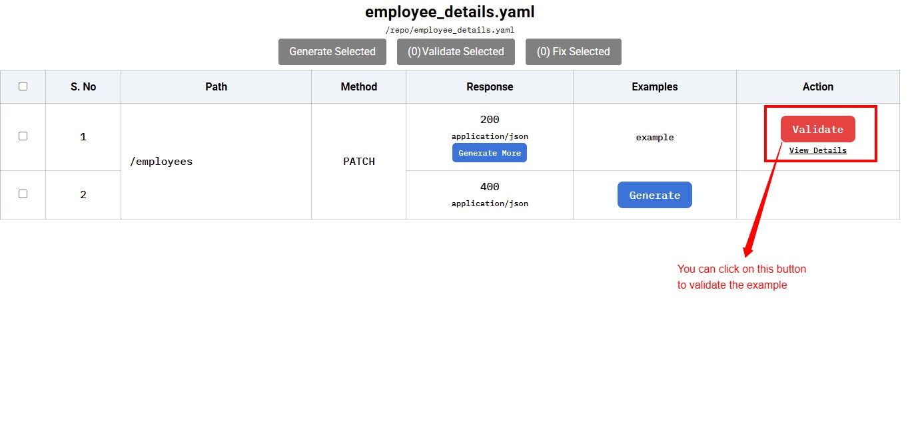

# External Examples

- [External Examples](#external-examples)
  - [Introduction](#introduction)
  - [Creating and Validating Examples](#creating-and-validating-examples)
    - [Pre-requisites](#pre-requisites)
    - [Using GUI - Paid Feature](#using-gui---paid-feature)
      -  [Fix the Example](#fix-the-example)
      -  [Validate the Example](#validate-the-example)
      -  [Generate the Example](#generate-the-example)
    - [Using CLI](#using-cli)
      - [Validate the Example](#validate-the-example-1)
  - [Example Format](#example-format)
  - [Advanced Usage](#advanced-usage)
    - [Working with Multiple Specifications](#working-with-multiple-specifications)
    - [Custom Example Directory](#custom-example-directory)
    - [Identifying Duplicate Examples](#identifying-duplicate-examples)
  - [Pro Tips](#pro-tips)

## Introduction

It may not always be possible to add examples inline in the OpenAPI specifications. And sometimes certain examples may not belong in the API specification. In such cases, we add examples outside the spec in the form of JSON files. But how do we ensure that these examples are valid and as per the specification? The answer is Specmatic's example validation capability.

With Specmatic's powerful validation capability you can validate these examples easily either locally or in CI pipelines. Whether you have a single specification or multiple specifications across different directories, Specmatic makes it easy to ensure your examples stay in sync with your API definitions.

## Creating and Validating Examples

Let's walk through a complete example to see how example validation works in practice.

### Pre-requisites

- Create a directory named `specmatic` in your home directory.
- Make sure you have installed Specmatic. Check the [Download](../download.html) page for all available options for installing Specmatic.
- Create the API specification file named `employee_details.yaml` (Optional)

```yaml
openapi: 3.0.0
info:
  title: Employees
  version: '1.0'
servers: []
paths:
  '/employees':
    patch:
      summary: ''
      requestBody:
        content:
          application/json:
            schema:
              $ref: '#/components/schemas/EmployeeDetails'
      responses:
        '200':
          description: Employee Created Response
          content:
            application/json:
              schema:
                $ref: '#/components/schemas/Employee'
        '400':
          description: Error response
          content:
            application/json:
              schema:
                $ref: '#/components/schemas/Error'
components:
  schemas:
    Error:
      type: object
      required:
        - message
      properties:
        message:
          type: string
    Employee:
      type: object
      required:
        - id
        - name
        - department
        - designation
      properties:
        id:
          type: integer
        employeeCode:
          type: string
        name:
          type: string
        department:
          type: string
        designation:
          type: string

    EmployeeDetails:
      type: object
      required:
        - name
        - department
        - designation
      properties:
        name:
          type: string
        employeeCode:
          type: string
        department:
          type: string
        designation:
          type: string
```
- Create the example in `employee_details_examples/example.json` (Optional)

```json
{
    "http-request": {
        "method": "PATCH",
        "path": "/employees",
        "body": {
            "employeeCode": "pqrxyz"
        }
    },
    "http-response": {
        "status": 200,
        "body": {
            "id": 10,
            "employeeCode": "pqrxyz",
            "name": "Jamie",
            "department": "(string)",
            "designation": "(string)"
        }
    }
}
```

By default, Specmatic looks for examples in a directory named `{specification-name}_examples` in the same location as your specification file. For instance, if your spec file is named `employee_details.yaml`, Specmatic will look for examples in the `employee_details_examples` directory.

## Using GUI - Paid Feature

You can easily generate, validate and fix examples using Specmatic GUI. To start the GUI execute below command,


```shell
docker run --rm -v "$(pwd):/repo" -p "9001:9001" znsio/specmatic-openapi examples interactive --contract-file /repo/employee_details.yaml
```


```shell
java -jar specmatic-openapi.jar examples interactive --contract-file /repo/employee_details.yaml
```



You can then click on the link provided by the command in the console, by default it will be http://localhost:9001/_specmatic/examples

### Validate the Example

In this section, we will see how you can validate the example,

> 

### Fix the Example

In this section, we will see how you can fix the example,

> 

### Generate the Example

In this section, we will see how you can generate the example,

> 

## Using CLI

### Validate the Example



```shell
docker run -v "$(pwd)/:/specs" znsio/specmatic examples validate --spec-file "/specs/employee_details.yaml"
```


```shell
java -jar specmatic.jar examples validate --spec-file employee_details.yaml
```


```shell
npx specmatic examples validate --spec-file employee_details.yaml
```



If you're using the [given example](#pre-requisites), You'll notice the validation fails because the request is missing required fields (`name`, `department`, and `designation`). The error message will guide you to fix these issues. Fix the example by adding the required fields and run the validation again and you’ll see it succeed!

**Note:** You can also integrate it with your CI and it will exit with a exit-code. An exit-code of `1` indicates validation failure, while `0` indicates success.

## Example Format

Examples can be externalized to `json` files as seen in the above section, You will find the example format reference below,

```json
{
    "http-request": {
        "method": "POST",
        "path": "/path/(number)/some/more/path",
        "headers": {
            "X-Header-Name": "(string)",
            "X-Header-ID": "(string)"
        },
        "query": {
            "id": "(number)",
            "type": "(string)"
        },
        "form-fields": {
            "Data": "(PredefinedJsonType)",
            "MoreData": "some hardcoded value"
        },
        "multipart-formdata": [
            {
                "name": "customers",
                "content": "(string)",
                "filename": "@data.csv",
                "contentType": "text/plain",
                "contentEncoding": "gzip"
            }
        ],
        "body": {
            "name": "Jane Doe",
            "address": "22 Baker Street"
        }
    },

    "http-response": {
        "status": 200,
        "headers": {
            "X-Header-Name": "(string)",
            "X-Header-ID": "(string)"
        },
        "body": "some value"
    }
}
```

**Notes on the `request` format:**

1. Multipart Form-data:
  - You can either provide `content` or `filename`, but not both
  - `filename` must start with @
  - `contentType` is optional, and is matched against the `Content-Type` header
  - `contentEncoding` is matched against the `Content-Encoding` header

2. Body can also just be a `string`, such "Hello world", or an `array`, such as [1, 2, 3]

**Notes on the `response` format:**

1. In contract tests, only the `status` field is required. Other fields will be ignored if provided such as headers, body etc.

## Advanced Usage

### Working with Multiple Specifications

If you're managing multiple API specifications, Specmatic provides flexible options to validate all their examples:

1. **Validate Multiple Specs with Default Example Locations**:

```shell
specmatic examples validate --specs-dir ./api-specs
```
This will look for example directories alongside each specification file.

2. **Organize Examples in a Separate Directory Structure**:

```shell
specmatic examples validate --specs-dir ./api-specs --examples-base-dir ./all-examples
```
This helps when you want to keep your examples organized separately from your specifications.

### Custom Example Directory

For a single specification, you can specify a custom examples directory:
```shell
specmatic examples validate --spec-file employee_details.yaml --examples-dir ./custom-examples
```

### Identifying Duplicate Examples

When working with multiple examples, it's important to ensure that an example request is unique. If more than one example has the same request, there may be consequences. For example, when an incoming request matches multiple examples, Specmatic stub server will pick one example and show it's response, ignoring the others.

You can detect this issue early by using Specamtic to validate your examples.

Let's try the validation out. We shall continue to use the `employee_details.yaml` spec from above.

**1.** Create an example in `employee_details_examples/employees_PATCH_200.json`:

```json
{
  "http-request": {
    "method": "PATCH",
    "path": "/employees",
    "body": {
      "name": "Jamie",
      "employeeCode": "pqrxyz"
    }
  },
  "http-response": {
    "status": 200,
    "body": {
      "id": 10,
      "employeeCode": "pqrxyz",
      "name": "Jamie",
      "department": "Backend",
      "designation": "Engineer"
    }
  }
}
```

**2.** Create a duplicate example in `employee_details_examples/employees_PATCH_400.json`:

```json
{
  "http-request": {
    "method": "PATCH",
    "path": "/employees",
    "body": {
      "name": "Jamie",
      "employeeCode": "pqrxyz"
    }
  },
  "http-response": {
    "status": 400,
    "body": {
      "message": "Invalid value"
    }
  }
}
```

Note that, for the same request payload, it has a different response.

**3.** Validate your examples:

```shell
docker run \
  -v "$(pwd)/:/specs" \
  znsio/specmatic-openapi examples validate --spec-file "/specs/employee_details.yaml"
```

Specmatic detects this, and prints the following warning:

```log
WARNING: Multiple examples detected having the same request.
  This may have consequences. For example when Specmatic stub runs, only one of the examples would be taken into consideration, and the others would be skipped.

  - Found following duplicate examples for request PATCH /employees
    - example in file '/usr/src/app/employee_details_examples/employees_PATCH_200.json'
    - example in file '/usr/src/app/employee_details_examples/employees_PATCH_400.json'
```

**NOTE**: While validation of examples for schema correctness is available *for free* in open source [Specmatic](https://github.com/znsio/specmatic), detection of duplicate examples as part of validation is a paid feature. Please visit the [pricing page](https://specmatic.io/pricing/) for more information.

## Pro Tips
- Use `--specs-dir` with `--examples-base-dir` when managing multiple APIs to keep your examples organized
- Specmatic automatically finds example directories using the `{spec-name}_examples` convention (e.g., `employee_details_examples` for `employee_details.yaml`)
- The validation command will exit with code `1` if any examples are out of sync, making it perfect for CI/CD pipelines

Need more details? Run the help command:


```shell
docker run znsio/specmatic examples validate --help
```


```shell
java -jar specmatic.jar examples validate --help
```


```shell
npx specmatic examples validate --help
```


