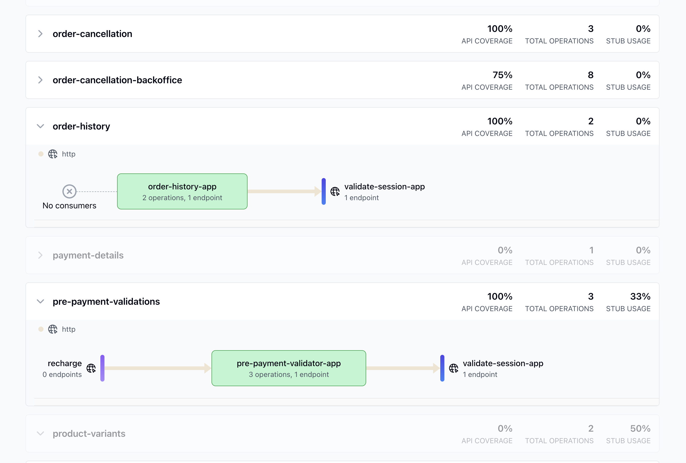

# Specmatic Insights

  - [Introduction](#introduction)
  - [Getting Started](#getting-started)
  - [Setting Up Specmatic Insights](#setting-up-specmatic-insights)
  - [Integrating with CI/CD Pipelines](#integrating-with-cicd-pipelines)
  - [Viewing Your Service Mesh](#viewing-your-service-mesh)
  - [Understanding the Dashboard](#understanding-the-dashboard)
  - [Troubleshooting](#troubleshooting)

## Introduction

Specmatic Insights is a powerful tool that aggregates Specmatic reports from various environments such as your CI/CD pipelines and visualizes how your organization's microservices interact with each other. This guide will walk you through the setup process and help you leverage the full potential of Specmatic Insights.

### Features

Specmatic Insights offers several key features:

- View your service dependency graph in real-time as your CI builds run
- Track CDD (Contract-Driven Development) adoption progress in your organization
- Identify dependencies between services
- Monitor API coverage and stub usage of your services

To know more about Specmatic Insights, visit [Insights page](https://insights.specmatic.io/).

## Getting Started

Before setting up Specmatic Insights, ensure you have completed the [Getting Started](https://specmatic.io/getting_started.html) steps for Specmatic. This typically involves setting up Specmatic in your development environment and integrating it into your testing process. 

In this tutorial we will be setting up insights based on the following services that we created in [Getting Started](https://specmatic.io/getting_started.html)

1. Pet Store Backend
2. Pet Store Client

## Setting Up Specmatic Insights

To start using Specmatic Insights:

1. Visit [insights.specmatic.io](https://insights.specmatic.io)
2. Go to the [registration section](https://insights.specmatic.io/dashboard/register)
3. Fill in your email and password, then click "Register".
4. Once registered, you'll have access to your Specmatic Insights dashboard. At the moment you won't see anything here.

## Integrating with CI/CD Pipelines

To get the most out of Specmatic Insights, you need to integrate it into your CI/CD pipelines. Follow these steps for both your provider and consumer services:

1. Ensure Specmatic is running in your pipeline and generating reports.
2. Add the Specmatic Insights GitHub Build Reporter to your workflow, after specmatic has run:

```yaml

- name: Run Specmatic Insights Github Build Reporter
  uses: znsio/specmatic-insights-build-reporter-github-action@v2.0.2
  with:
    github-token: ${{ secrets.SPECMATIC_GITHUB_TOKEN }}
    specmatic-insights-host: https://insights.specmatic.io # Or your on-prem URL
    specmatic-reports-dir: ./build/reports/specmatic # Or your custom path
    org-id: YOUR_SPECMATIC_ORG_ID # Replace with your actual Org ID
    branch-ref: ${{ github.ref }}
    branch-name: ${{ github.ref_name }}
    build-id: ${{ github.run_id }}
    repo-name: ${{ github.event.repository.name }}
    repo-id: ${{ github.repository_id }}
    repo-url: ${{ github.event.repository.html_url }}

```

For more details refer  to the [Specmatic Insights GitHub Action documentation](https://github.com/znsio/specmatic-insights-build-reporter-github-action)

Make sure to replace `YOUR_SPECMATIC_ORG_ID` with your actual organization ID. This you can find on your insights dashboard, under settings > general.

## Viewing Your Service Mesh

Once your CI/CD pipelines are set up and have run, you can view your service mesh on the Specmatic Insights dashboard:

1. Log in to your Specmatic Insights account.
2. Navigate to the main dashboard.
3. You should see a visualization of your services and their dependencies.

For example, if you've been following the Petstore example from [Getting Started](https://specmatic.io/getting_started.html), your service mesh might look like this:


## Understanding the Dashboard

The Specmatic Insights dashboard provides several key pieces of information:

- **Service Dependency Graph**: Shows how your services are interconnected.
- **API Coverage**: Indicates how much of your API is covered by tests and contracts.
- **Operations Usage**: Breaks down operations used by both providers and consumers, as tests only, and as stubs only.

Here's an example of what you might see if you have followed the instructions and have been able to setup insights



## Troubleshooting

If you're not seeing your services on the dashboard:

1. Ensure your CI/CD pipelines are correctly set up with the Specmatic Insights Build Reporter.
2. Check that your `org-id` is correct in the GitHub action configuration.
3. Verify that your Specmatic reports are being generated in the specified directory. (./build/reports/specmatic)

For further assistance, please contact [Specmatic support](https://specmatic.io/contact-us/).