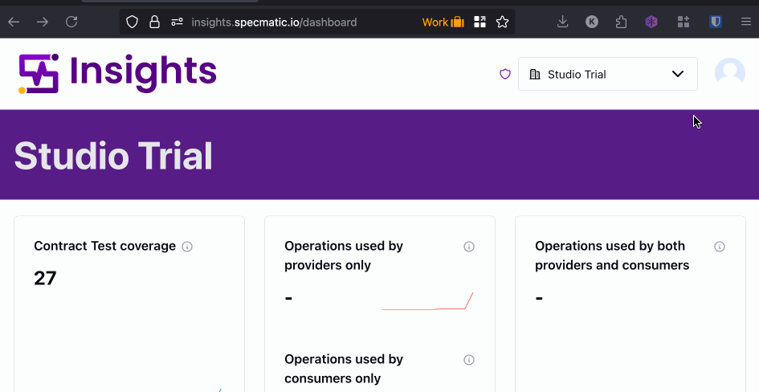

# Provisioning and Using Specmatic License Keys

<!-- TOC -->

- [Provisioning and Using Specmatic License Keys](#provisioning-and-using-specmatic-license-keys)
  - [Types of Specmatic Licenses](#types-of-specmatic-licenses)
    - [User Licenses](#user-licenses)
      - [How to retrieve your user license](#how-to-retrieve-your-user-license)
      - [Validate your user license](#validate-your-user-license)
      - [Using Specmatic License with Docker](#using-specmatic-license-with-docker)
    - [Service Account Licenses](#service-account-licenses)
      - [Using the service account license key in CI/CD or automated systems](#using-the-service-account-license-key-in-cicd-or-automated-systems)

<!-- /TOC -->

## Types of Specmatic Licenses

Specmatic provides two types of licenses:

**1\. User License:** Intended for individual users such as developers and testers who use Specmatic interactively (locally, or for manual contract authoring and testing). Each user should generate their own license key from the Specmatic Insights Server.

**2\. Service Account License:** Intended for automated systems, build servers, or shared environments where Specmatic is run as part of a service or automation. Service account licenses can be generated and managed centrally for use by these systems.

Both license types are managed and downloaded from the Specmatic Insights Server. The setup and usage instructions for each are provided in the sections below.

### User Licenses

User licenses are intended for human users who want to use Specmatic interactively, such as running Specmatic locally for contract authoring, testing and mocking. Each user should download their own license key from the Specmatic Insights Server.

#### How to retrieve your user license
{: style="font-size:1.1rem!important;letter-spacing:0.5px;margin-bottom:1rem" }

**Step 1.** Login into [Specmatic Insights](https://insights.specmatic.io) to ensure you've a valid account.

**Step 2.** Download your user license by executing the following command in your terminal:

{: style="margin:0;" }


```shell
specmatic get-license
```
Please refer to the [downloads page](/download.html#specmatic-open-source) if the `specmatic` command is not found.


```shell
docker run -it --rm -v ~/.specmatic:/root/.specmatic specmatic/specmatic get-license
```


```shell
docker run -it --rm -v "${env:USERPROFILE}/.specmatic:/root/.specmatic" specmatic/specmatic get-license
```


```shell
docker run -it --rm -v "%USERPROFILE%\.specmatic:/root/.specmatic" specmatic/specmatic get-license
```



Executing the command will result in the following output appearing in your terminal:
```shell
Specmatic Version: v2.24.0

Please visit https://insights.specmatic.io/dashboard/validate-license?code=XXXXX and validate your license request
```

Click the link to validate your license request in the browser, following the given instructions.<br/>
Once validated, Specmatic will automatically download your license file in the background and display the retrieved license details in the terminal as follows:

```plain
License successfully retrieved.
Got license:
Licensed to: your-email@example.com
Start date: September 26, 2025 at 10:10:17 PM IST
Expiry date: October 3, 2025 at 10:10:17 PM IST
License type: ENTERPRISE
Rate limit: 100
Organisation ID: ...
Insights server: https://insights.specmatic.io
License ID: ...
```

#### Validate your user license
{: style="font-size:1.1rem!important;letter-spacing:0.5px;margin-bottom:1rem" }

To check if you have a valid license, you can run the following command:



```shell
specmatic show-license
```


```shell
docker run -it --rm -v ~/.specmatic:/root/.specmatic specmatic/specmatic show-license
```


```shell
docker run -it --rm -v "${env:USERPROFILE}/.specmatic:/root/.specmatic" specmatic/specmatic show-license
```


```shell
docker run -it --rm -v "%USERPROFILE%\.specmatic:/root/.specmatic" specmatic/specmatic show-license
```



The retrieved license file must be stored in `~/.specmatic`. If you are using Docker, make sure to mount this directory to `/root/.specmatic` within your Docker container.
If you are executing the commands mentioned above as-is, this will be handled automatically.
{: .note}

#### Using Specmatic License with Docker
{: style="font-size:1.1rem!important;letter-spacing:0.5px;margin-bottom:1rem" }

When using Specmatic with Docker, you must pass the license key as follows:



```shell
docker run -it --rm -v ~/.specmatic:/root/.specmatic specmatic/specmatic-openapi -h
```


```shell
docker run -it --rm -v "${env:USERPROFILE}/.specmatic:/root/.specmatic" specmatic/specmatic-openapi -h
```


```shell
docker run -it --rm -v "%USERPROFILE%\.specmatic:/root/.specmatic" specmatic/specmatic-openapi -h
```



Refer to the [Specmatic Docker Images documentation](/references/docker_images.html) for more details on using Specmatic with Docker.

---

### Service Account Licenses

**Only to be used by Admins** who are setting up Specmatic for automated systems, build servers, or shared environments.



1. Login to your [Specmatic Insights account](https://insights.specmatic.io).
2. Navigate to the "Settings" section.
3. Select the "License" tab.
4. Click on the "Generate" button.
5. Enter the license name, and any tags you wish to associate with the license.
6. Click "Generate" to create the license key.
7. Click the "Download" button to download the license file (`specmatic-license.txt`)

#### Using the service account license key in CI/CD or automated systems

[Enterprise Onboarding - Specmatic License Keys](/enterprise_onboarding/insights.html#step-2-configuring-specmatic-insights) provides detailed instructions on how to set up and use the license key in CI/CD pipelines and automated systems.
